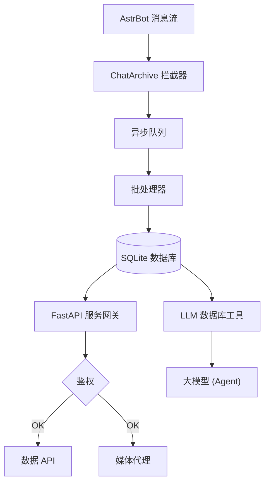

# ⚡ AstrBot Chat Archive Plugin (聊天记录存档插件)

<p align="center">
  
</p>

<p align="center">
  <strong>为 <a href="https://docs.astrbot.app/">AstrBot</a> 打造的轻量级聊天记录存档与可视化管理面板插件。</strong>
</p>

<p align="center">
  
  
  
</p>

## ✨ 功能特性

* **异步消息存盘**：采用独立的消息队列，异步批量写入数据库，不阻塞机器人主进程。
* **内置 Web 仪表盘**：默认运行于 `8090` 端口。支持搜索回放、发言统计与活跃排行。
* **多媒体本地缓存**：支持图片/视频本地缓存，解决失效与跨域问题，自带 SSRF 安全防护。
* **AI 对话长线记忆**：为大模型注册数据库工具，使其能够检索历史聊天记录。
* **高可扩展性**：支持其他插件动态挂载自定义 Web 路由。

---

## 🛠️ 安装方法

1. 进入插件目录并克隆：
   ```bash
   cd AstrBot/data/plugins
   git clone https://github.com/YukiNo420/astrbot_plugin_chat_archive.git
   cd astrbot_plugin_chat_archive
   ```
2. 安装依赖：
   ```bash
   pip install -r requirements.txt
   ```
3. 重启 AstrBot 即可完成初始化。

---

## ⚙️ 配置说明

| 配置项 | 默认值 | 说明 |
| :--- | :--- | :--- |
| `cache_media` | `false` | 是否开启媒体本地缓存。 |
| `db_path` | `""` | 自定义数据库路径，支持环境变量与 `~` 展开。 |
| `host` | `127.0.0.1` | Web 监听地址。公网访问请配合 `api_key` 使用。 |
| `api_key` | `""` | 访问密码。留空则每次启动生成随机密码并打印在日志。 |
| `port` | `8090` | Web 服务端口。 |

*更多详细配置（白名单、日志模式等）请参考 AstrBot 后台设置页面。*

---

## 🛠️ 高级部署与二次开发

如果您对内置前端不满意，或者希望实现前后端解耦部署（如使用 systemd 独立管理 Web 服务），我们在 `contrib/` 目录下提供了一个基础的 `systemd` 服务模板供您参考和修改。

启用独立服务前，请务必在插件配置中将 `web_server.enable` 设置为 `false`，以避免端口冲突。

---

## 🏗️ 系统架构



## 📄 开源许可证

本项目基于 **[AGPL-3.0](LICENSE)** 协议发布。
