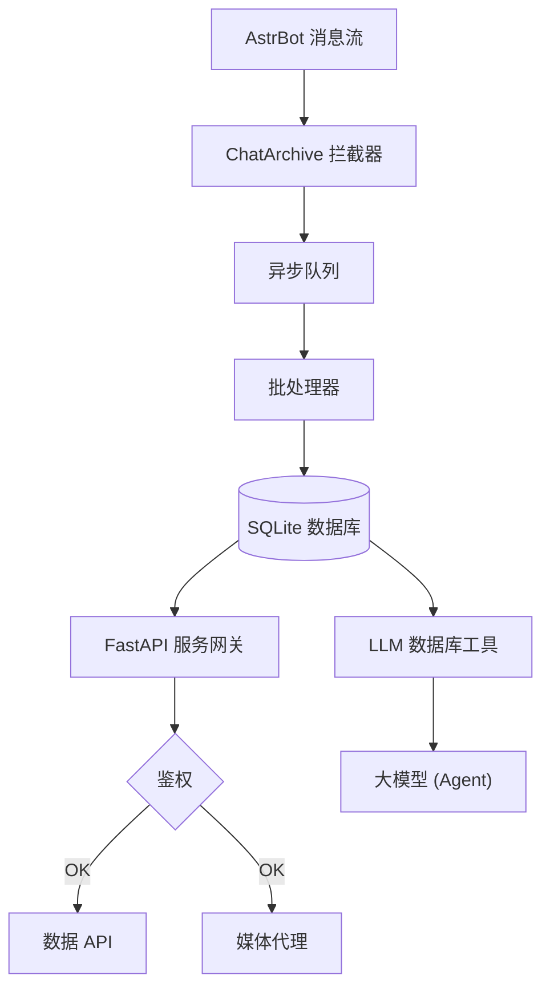

# ⚡ AstrBot Chat Archive Plugin (聊天消息存档插件)

<p align="center">
  
</p>

<p align="center">
  <strong>为 <a href="https://docs.astrbot.app/">AstrBot</a> 打造的轻量级聊天消息存档与可视化管理面板插件。</strong>
</p>

<p align="center">
  
  
  
</p>

> 本插件是一款面向 [AstrBot](https://docs.astrbot.app/) 的聊天记录存档工具。它在后台静默接收并持久化群组与私聊消息，同时提供一个内置的 Web 管理面板，用于历史消息的浏览、检索与数据分析。所有数据均存储于本地 SQLite 数据库，无需依赖外部服务。

## ✨ 功能特性

* 🚀 **异步无感知消息存档**：采用独立的异步消息队列，消息由后台批量写入数据库，对机器人主流程零阻塞、零影响。
* 📊 **内置 Web 可视化管理面板**：默认监听 `8090` 端口，开箱即用。支持历史消息浏览与全文检索，并提供群成员发言统计与活跃度排行等数据分析功能。
* 🖼️ **媒体文件本地缓存**：支持将图片、视频等媒体文件下载并缓存至本地，彻底解决 QQ 原图过期失效与防盗链问题，同时内置域名白名单机制以防范 SSRF 攻击。
* 🧠 **为大模型提供长期记忆**：向 LLM Agent 注册数据库检索工具，使模型能够自主查询任意时间段的历史消息，有效突破上下文长度限制。
* 🔌 **插件扩展友好**：提供开放的 Web 路由挂载接口，其他插件可便捷地在本插件的 Web 服务上注册自定义 API 端点。


---

## 🛠️ 安装方法

1. 进入 AstrBot 插件目录并克隆本仓库：
   ```bash
   cd /path/to/AstrBot/data/plugins
   git clone https://github.com/YukiNo420/astrbot_plugin_chat_archive.git
   cd astrbot_plugin_chat_archive
   ```
2. 安装 WebUI 依赖：
   ```bash
   python3 -m pip install -r requirements.txt
   ```
3. 在 AstrBot 后台配置安全的 `api_key`，然后重启 AstrBot 完成初始化。

---

## ⚙️ 配置说明

### 基础设置（`basic`）

| 配置项 | 默认值 | 说明 |
| :--- | :--- | :--- |
| `enable_archive` | `true` | 是否实时记录聊天消息到数据库中。 |
| `ignored_users` | `[]` | 不希望被记录的用户 ID 列表（如机器人自身的 QQ 号）。 |
| `cache_media` | `false` | 是否开启媒体本地缓存。 |
| `allowed_media_domains` | QQ 媒体域名白名单 | 允许缓存/代理的媒体域名及其子域名，防止 SSRF 访问内网。 |
| `media_max_mb` | `50` | 单个媒体缓存/代理的最大体积，范围 1–200 MB。 |
| `enable_clean` | `false` | 是否定期自动清理过期的媒体缓存文件。 |
| `clean_days` | `30` | 缓存文件保留的最大天数，超期文件将被自动删除。 |
| `db_path` | `""` | 自定义数据库路径，支持环境变量与 `~` 展开，留空使用默认位置。 |
| `sqlite_journal_mode` | `WAL` | SQLite 日志模式。NAS/NFS/SMB 等网络盘可尝试 `DELETE`。 |

### WebUI 面板设置（`web_server`）

| 配置项 | 默认值 | 说明 |
| :--- | :--- | :--- |
| `enable` | `true` | 是否启用内置 Web 服务。独立部署时应设为 `false` 以避免端口冲突。 |
| `host` | `127.0.0.1` | Web 监听地址。公网访问请配合强随机 `api_key` 与防火墙使用。 |
| `port` | `8090` | Web 服务端口。 |
| `api_key` | `""` | 访问密码。留空则每次启动生成随机密码并打印在日志。 |

### 环境变量覆盖

| 环境变量 | 说明 |
| :--- | :--- |
| `ARCHIVE_API_KEY` | 覆盖 WebUI API Key。 |
| `ARCHIVE_HOST` / `ARCHIVE_PORT` | 覆盖 WebUI 监听地址与端口。 |
| `ARCHIVE_DB_PATH` | 覆盖 SQLite 数据库路径。 |
| `ARCHIVE_DATA_DIR` | 覆盖插件数据目录。 |
| `ARCHIVE_CONFIG_PATH` | 覆盖 AstrBot 插件配置 JSON 路径。 |
| `ARCHIVE_ALLOWED_MEDIA_DOMAINS` | 逗号分隔的媒体域名白名单。 |
| `ARCHIVE_MEDIA_MAX_MB` | 覆盖单个媒体最大体积。 |
| `ARCHIVE_SQLITE_JOURNAL_MODE` | 覆盖 SQLite 日志模式。 |
| `ARCHIVE_CORS_ORIGINS` | 逗号分隔的允许跨域来源。 |

---

## 🏗️ 系统架构



---

## 🚀 高级部署与二次开发

如果您对内置前端不满意，或者希望实现前后端解耦部署（如使用 systemd 独立管理 Web 服务），我们在 `contrib/` 目录下提供了一个基础的 `systemd` 服务模板供您参考和修改。

启用独立服务前，请务必在插件配置中将 `web_server.enable` 设置为 `false`，以避免端口冲突。

独立运行 WebUI 时必须设置 `api_key`，可以写入 AstrBot 插件配置，也可以通过环境变量传入：

```bash
export ARCHIVE_API_KEY='change-me-to-a-long-random-secret'
export ARCHIVE_HOST='127.0.0.1'
export ARCHIVE_PORT='8090'
python3 -m astrbot_plugin_chat_archive.web.server
```

如果需要局域网访问，请将 `host` 或 `ARCHIVE_HOST` 改为 `0.0.0.0`，并同时配置防火墙与强随机 `api_key`。

---

## 📦 发布仓库范围

本仓库是插件的发布仓库，根目录即 AstrBot 插件目录。推送内容应保持精简，只包含运行插件所必需的文件。

当前 GitHub 仓库结构：

```text
astrbot_plugin_chat_archive/
├── .gitignore
├── CHANGELOG.md
├── DEVELOPER.md
├── LICENSE
├── README.md
├── _conf_schema.json
├── contrib/
│   └── astr_archive_web.service
├── db_config.py
├── logo.png
├── main.py
├── metadata.yaml
├── requirements.txt
└── web/
    ├── server.py
    ├── static/
    │   ├── css/main.css
    │   ├── js/main.js
    │   └── logo.png
    └── templates/index.html
```

允许推送：

- 插件运行代码：`main.py`、`db_config.py`、`web/`
- 插件元数据与配置：`metadata.yaml`、`_conf_schema.json`、`requirements.txt`
- 用户说明与发布记录：`README.md`、`CHANGELOG.md`、`LICENSE`
- 运行或部署所需资源：`logo.png`、`contrib/`

不要推送：

- 测试目录或测试脚本：`tests/`、`test_*.py`
- 开发文档、评审记录、实现计划：`docs/`、`implementation_plan.md`、`*_review.md`
- Python/前端缓存与构建产物：`__pycache__/`、`.pytest_cache/`、`node_modules/`、`dist/`
- 本地运行数据：数据库、日志、媒体缓存、临时文件
- 与本次功能发布无关的实验代码或草稿

推送前建议检查：

```bash
git fetch origin main
git status --short
git diff --stat
git ls-tree -r --name-only HEAD
```

确认只包含上述允许范围内的文件后再提交和推送。

---

## 📄 开源许可证

本项目基于 **[AGPL-3.0](LICENSE)** 协议发布。

---

## ⚠️ 免责声明

本插件仅供学习、研究与个人合法用途使用。使用者应自行确保其使用行为符合所在地区的法律法规及相关平台的服务条款，包括但不限于个人信息保护、数据存储与隐私相关规定。

- **请勿** 将本插件用于未经授权地收集、存储或传播他人的聊天内容。
- **请勿** 将存档数据用于任何商业目的或侵犯他人隐私的行为。
- 在群组中部署本插件前，建议提前告知群成员消息将被记录。

本项目作者不对因使用本插件产生的任何直接或间接损失、法律纠纷或数据泄露承担责任。**使用即视为您已理解并同意上述条款。**
