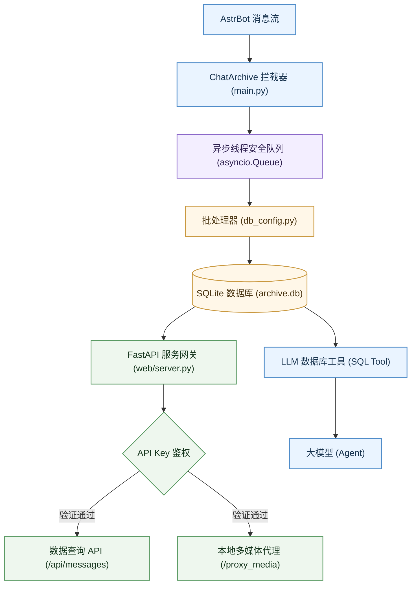

# ⚡ AstrBot Chat Archive Plugin (聊天记录存档插件)

<p align="center">
  
</p>

<p align="center">
  <strong>为 <a href="https://docs.astrbot.app/">AstrBot</a> 打造的轻量级聊天记录存档与可视化管理面板插件。</strong>
</p>

<p align="center">
  
  
  
</p>

## ✨ 功能特性

* **异步消息存盘**：采用独立的消息队列，由后台协程异步批量写入数据库，避免高频聊天时阻塞机器人主进程。
* **内置 Web 仪表盘**：默认运行于 `8090` 端口。支持聊天历史搜索、多媒体消息卡片回放、发言量趋势统计与用户发言活跃度排行。
* **多媒体本地缓存**：支持将图片、视频缓存到本地，并通过本地流式网关代理，解决平台图片失效和跨域问题。
* **AI 对话上下文感知**：自动为大模型注册数据库查询工具，使其能够主动调取并检索历史聊天记录，建立长线记忆。
* **高可扩展性**：提供 `@ChatArchiveWeb` 装饰器，允许其他插件在无需修改本插件源码的情况下，动态挂载自定义 Web 路由。

---

## 🛠️ 安装方法

进入您的 AstrBot 插件目录：

```bash
cd AstrBot/data/plugins
git clone https://github.com/YukiNo420/astrbot_plugin_chat_archive.git
```

重启 AstrBot 即可自动加载插件并初始化 SQLite 数据库。

---

## ⚙️ 配置说明

您可以在 AstrBot 的 WebUI 管理后台中直接配置以下参数：

| 配置项 | 类型 | 默认值 | 详细说明 |
| :--- | :--- | :--- | :--- |
| `enable_archive` | Boolean | `true` | 是否实时将消息同步到数据库。 |
| `ignored_users` | List | `[]` | 填入不希望被记录的用户 ID 列表（如机器人自己的 ID）。 |
| `cache_media` | Boolean | `false` | 是否自动将图片/视频下载到本地，防止在线链接过期失效。 |
| `api_key` | String | `""` | Web 仪表盘的访问验证密码。若留空，每次启动时都会在控制台生成一个随机密码。 |
| `port` | Integer | `8090` | Web 仪表盘监听的本地端口（需重启生效）。 |

### ⚠️ [重要] 自动生成密码控制台样式说明
如果您未在配置中指定 `api_key`，为保障您的隐私安全，本插件在启动时会自动生成一个强随机密码。**您需要在启动控制台或终端的滚动日志中寻找如下高亮安全警示框**：

```log
============================================================
[Chat Archive 安全警告] 您未在配置中指定访问验证 Key (api_key)！
为了保障您的聊天记录隐私，系统已自动生成一个强随机密码：
👉👉 mX92_kSLaBdf9Q4s1Lq7Ow 👈👈
请使用上述密码登录 Web 仪表盘。您随时可以在插件的配置选项中设置自定义的 api_key。
============================================================
```

请复制指向符 `👉👉 ... 👈👈` 之间的密码字符串登录您的 Web 仪表盘。建议您在后台配置一个固定的 `api_key` 以免重启后密码变更。

---

## 🛠️ Systemd 独立解耦部署教程

如果您希望实现**前后端完全解耦**（即禁用 AstrBot 内部的 Web 守护线程，改由 Linux 系统级的 `systemd` 独立管理并运行前端 Web 界面，从而彻底避免端口抢占和多线程并发干扰），可以按照以下步骤进行配置：

### 1. 禁用插件内置的 Web 服务
1. 进入 AstrBot 的 WebUI 管理后台；
2. 找到本插件的配置页面，将 **“启用内置 Web 服务 (`web_server.enable`)”** 开关设置为 `false`；
3. 保存配置并重启 AstrBot。此时，机器人将仅充当后台数据拦截和存盘的角色，不再监听 `8090` 端口。

### 2. 配置并安装 systemd 服务
本仓库的根目录下提供了一份 `astr_archive_web.service` 守护服务模版。

1. **创建系统服务目录**（如果是个人用户级部署，推荐使用 `--user` 守护模式）：
   ```bash
   mkdir -p ~/.config/systemd/user/
   ```
2. **复制服务文件**：
   ```bash
   cp astr_archive_web.service ~/.config/systemd/user/
   ```
3. **编辑服务参数**：
   使用编辑器打开 `~/.config/systemd/user/astr_archive_web.service`，将其中的路径替换为您的**实际物理绝对路径**：
   * `WorkingDirectory`：指向您 AstrBot 插件目录下的 `web` 文件夹绝对路径。
   * `ExecStart`：指向您的 AstrBot 使用的 Python 虚拟环境执行文件（如 `/home/user/AstrBot/.venv/bin/python3`），或者系统的 `/usr/bin/python3`。
4. **启动并启用服务**：
   ```bash
   # 重新加载服务配置文件
   systemctl --user daemon-reload

   # 启动独立 Web 服务
   systemctl --user start astr_archive_web.service

   # 设置为开机自启
   systemctl --user enable astr_archive_web.service

   # 查看运行日志和状态
   systemctl --user status astr_archive_web.service
   ```

此时，FastAPI 独立前端服务将在后台由 systemd 独立、稳定地守护运行，并完美兼容您插件主配置文件中的验证 Key！

---

## 🏗️ 系统架构



---

## 📂 目录结构

```bash
astrbot_plugin_chat_archive/
├─ _conf_schema.json                 # 配置参数骨架声明
├─ astr_archive_web.service          # systemd 系统守护服务模版
├─ db_config.py                      # 数据库层与批写入队列控制
├─ DEVELOPER.md                      # 开发者扩展接口指南
├─ LICENSE                           # 开源协议 (AGPL-3.0)
├─ logo.png                          # 插件徽标
├─ main.py                           # 插件主入口与生命周期管理
├─ metadata.yaml                     # 插件市场元数据
├─ README.md                         # 项目中文指南
└─ web/                              # 内置 Web 后台与前端模板
   ├─ server.py                      # FastAPI Web 服务、多媒体代理与安全网关
   ├─ templates/                     # Jinja2 模板
   └─ static/                        # CSS/JS 静态资源
```


## 📄 开源许可证

本项目基于 **[GNU Affero General Public License v3.0 (AGPL-3.0)](LICENSE)** 开源协议发布，分发或修改代码时请严格遵守开源规定。
